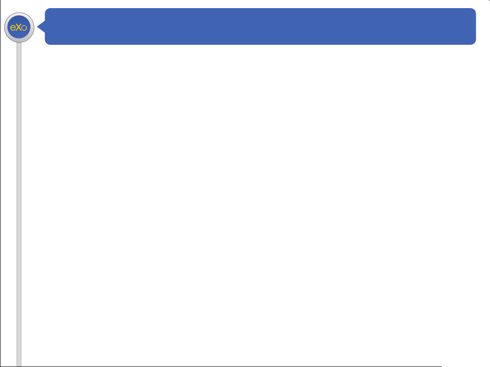

:id: Opening
:class: opening-slide

   

   

Digital Collaboration Platform

**eXo Developer Training**
   :class: bigText

----

:id: chapter-slide
:class: chapter-slide

Portlets
========

How to develop with portlets?
-----------------------------

:id: slide1
:class: slide

Agenda
=======

.. _slide1:

* Concepts
* MVC Phases
* Portlet versus Gadget
* Architecture
* JSP Code Snippets
* Portlet Preferences
* Simplest Hello World

:id: slide2
:class: slide

Syntax
=======
1. *Text as Italics* 
2. **Blod text** 
3. External hyperlinks, like eXo Documentation_.
 
.. _Documentation: https://docs.exoplatform.org/ 

----

:class: slide-no-title

2. Table

Simple table:

=====  =====  ======
   Inputs     Output
------------  ------
  A      B    A or B
=====  =====  ======
False  False  False
True   False  True
False  True   True
True   True   True
=====  =====  ======

:id: final
:class: opening-slide

Final Slide
===========
That's All Folks !

